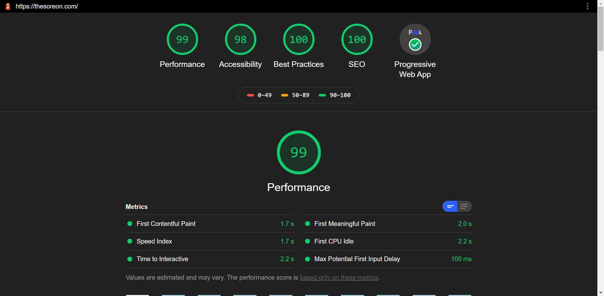
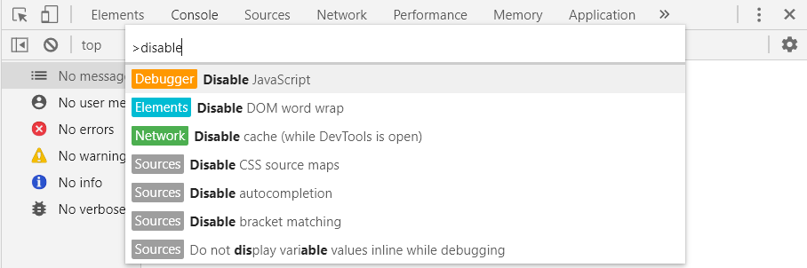
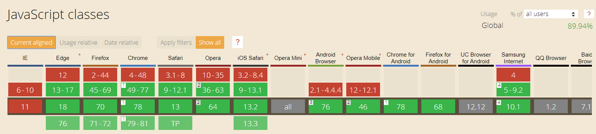
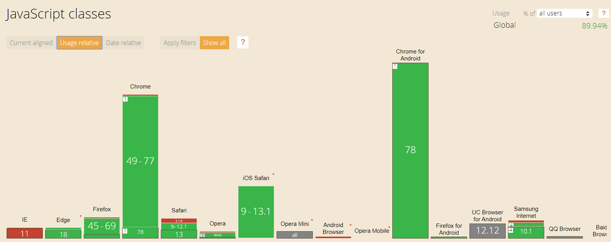
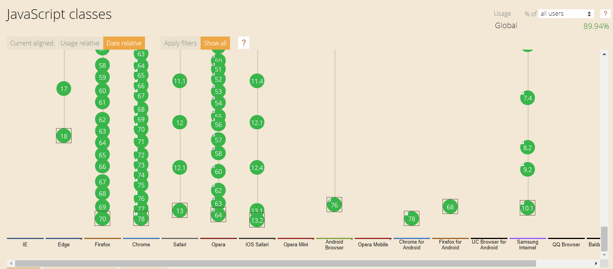
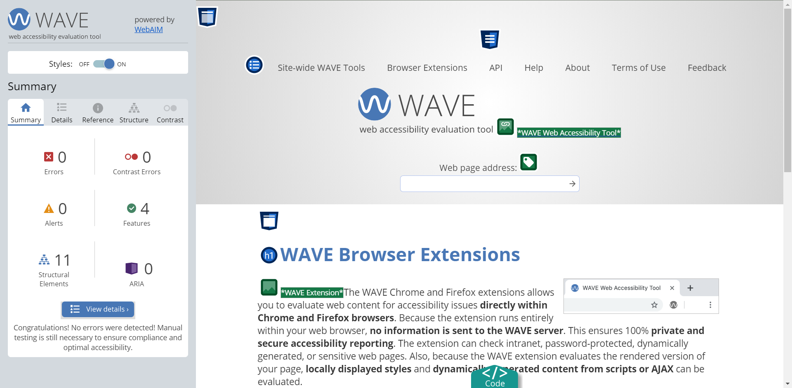
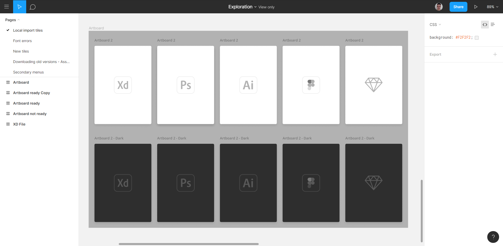

# Introduction

We all want to be as effective as possible that's why we are developing things which boost our (and others) productivity, but we are also using tools from other developers, who made these tools with the same reason.

So I want to introduce you to my top 5 tools (for web developers) I'm using on an everyday basis. The list is not sorted in any way, all of these tools are very amazing and make our life easier.

You can leave a comment down below with your curated list of favourite tools for web developers!

So let's get started 🚀

## Lighthouse

**Lighthouse** is an amazing (open source) tool made by Google. It reports important aspects of our web pages, such as Seo, Performance, Accessibility, Best practises and more!

Amazing feature of Lighthouse is that it can be used in many ways, the most popular one is using official [Google Chrome Extension](https://chrome.google.com/webstore/detail/lighthouse/blipmdconlkpinefehnmjammfjpmpbjk), but you aren't bound to using only Chrome extension, other ways are:

- [Node CLI](https://www.npmjs.com/package/lighthouse)
- [Web UI](https://developers.google.com/speed/pagespeed/insights/)

Note that with Web UI you don't have to install anything, however, you are limited by the available options. When using the extension you can "emulate" CPU throttling and internet speed, so you can see how is your website doing on low-end hardware devices, isn't that awesome?

## Chrome and Firefox devtools

Personally, I don't use Firefox devtools that much, but I would say using both of them in parallel is great because each of them has amazing features the other one doesn't have. For example, Firefox has an amazing accessibility tool!

### My Chrome devtools tip

If you hit `Ctrl+Shift+P` (while devtools are opened), you will be prompted with a search bar, where you can type command you want to execute. So for example, if you want to quickly disable Javascript without going to Chrome settings or searching the checkbox in devtools, you can type it!

## Can I use

[caniuse](https://caniuse.com/)

**Can I Use** is probably the most known website for all developers. It lets you quickly find how well is Javascript API or CSS property supported in most popular web browsers.

Below we can see the default view of searched Javascript API. It shows us in which versions of browsers is the API available, but there two more very interesting views, let's try them!

Another view is `Usage relative`, very handy view if you have gathered data about which browsers your audience uses and if you need to polyfill (or change) certain features in your app to work correctly for your audience.

Last view is `Date relative`, where you can clearly see in which version of the browser was a certain feature added.

## Web Accessibility Evaluation Tool (WAVE)

[WAVE](https://wave.webaim.org/extension/)

**WAVE** is an extension for Chrome and Firefox. When you click it in your extension list bar, it will wrap your current visited site with its UI interface, where you can see accessibility summary of the page. It shows things like Contrast errors, accessibility errors, but also it shows features your site provides to improve accessibility.

## Figma

[Figma](https://www.figma.com/)

**Figma** is one of the most amazing tools I have seen lately. It is a UI design and prototyping tool. Similar to tools like Adobe XD and Sketch, but Figma is web-based (but you can, of course, download desktop app), which is very powerful. It has many pros such as very good performance, real-time collaboration with your team members and FREE pricing plan, which offers all features of Figma (with unlimited export and much more) and if you are a student you can get Professional plan for **free**!

If I haven't convinced you to try Figma, try to read more information on official Figma site [here](https://www.figma.com/pricing). I believe you'll fall in love with it!
